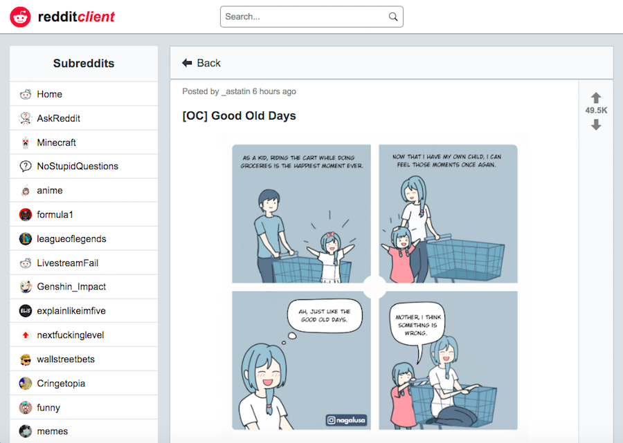

# Reddit Client

## About

An application that allows users to view and search posts and comments provided by the Reddit JSON API.




## Motivation

This project is part of the [Codecademy Front-End Engineer](https://www.codecademy.com/learn/paths/front-end-engineer-career-path) career path.


## Technologies

React / Redux.


## Installation Instructions

```
$ git clone https://github.com/HannaEb/reddit-client.git
$ cd reddit-client
$ npm install
$ npm start
```

Then open [http://localhost:3000](http://localhost:3000) to view the application in the browser.


## Testing

Jest, Enzyme. To run the tests, simply run `npm test` in your terminal.


## Progress

The test suite needs to be improved.


## Author

HannaEb
